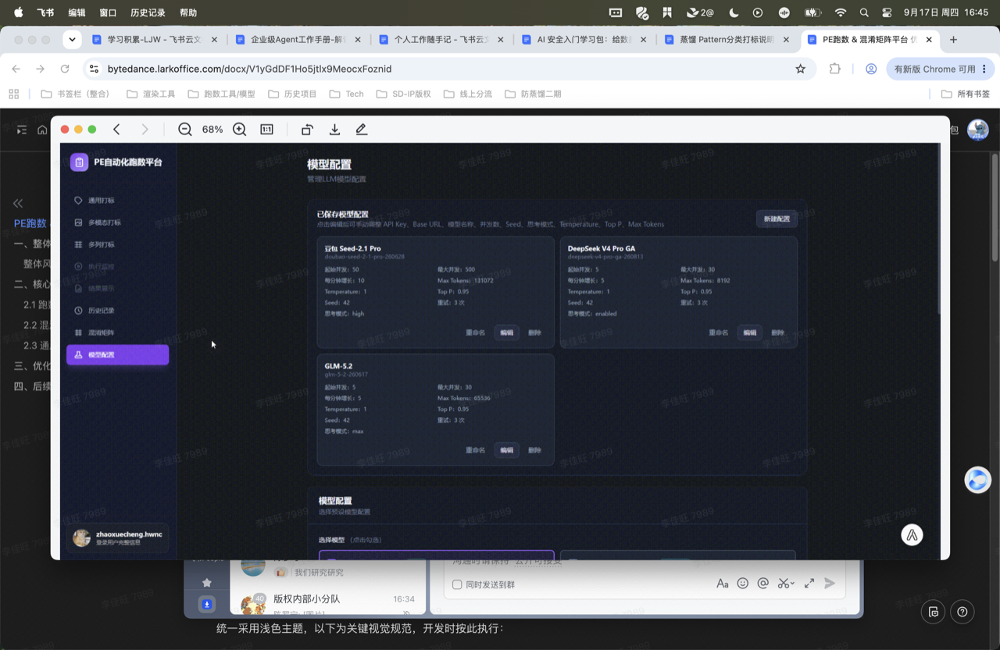

# 地球Online

把现实世界变成你的开放世界游戏。一个纯前端的 AI 驱动生活游戏，用 LLM 结合用户画像和实时环境信息生成每日任务，帮你打破重复生活的 NPC 循环。

> 单机运行，数据本地存储，用户自带 API Key。无后端、无服务器、无数据上传。



## 功能特性

- **AI 每日任务**：每天生成 3 个专属任务（主线 / 探索 / 随机），结合你的兴趣、目标、天气和位置
- **角色成长系统**：等级、经验、五维属性（体力 / 智力 / 魅力 / 勇气 / 创造力）、9 个成就徽章
- **感想记录与 AI 分析**：完成任务后记录感想，AI 自动提炼成长关键词
- **天气同步**：接入和风天气，任务生成会考虑当前天气（雨天优先室内任务等）
- **冒险时间线**：按时间回溯所有完成的任务和感想
- **数据完全本地**：所有数据存在浏览器 localStorage，支持 JSON 导出
- **演示模式**：无需 API Key 即可体验完整界面和交互流程，内置模拟数据

## 快速开始

### 先试试演示模式

打开页面后点击「没有 API Key？先体验演示模式」，即可用内置模拟数据浏览完整应用，包括任务列表、角色面板、时间线等。

### 方式一：直接打开

```bash
# 克隆或下载项目后，直接用浏览器打开
open index.html
```

### 方式二：本地服务器（推荐）

部分浏览器对 `file://` 协议下的 fetch 有安全限制，建议用本地 HTTP 服务器运行：

```bash
# Python 3
python3 -m http.server 8080

# 或 Node.js
npx serve .

# 然后访问 http://localhost:8080
```

### 首次配置

1. 打开页面后填写主角名称、兴趣标签、主线目标
2. 配置 LLM API Key（必填），支持任何 OpenAI 兼容接口
3. 可选配置和风天气、高德地图 Key
4. 点击「进入地球Online」，然后在任务页点击「生成今日任务」

## API 配置

### LLM（必填）

支持所有 OpenAI 兼容格式的 API 服务：

| 服务商 | Base URL | 推荐模型 |
|--------|----------|----------|
| OpenAI | `https://api.openai.com/v1` | `gpt-4o-mini` |
| DeepSeek | `https://api.deepseek.com/v1` | `deepseek-chat` |
| 字节豆包 | `https://ark.cn-beijing.volces.com/api/v3` | 接入点 ID |
| 月之暗面 | `https://api.moonshot.cn/v1` | `moonshot-v1-8k` |
| 通义千问 | `https://dashscope.aliyuncs.com/compatible-mode/v1` | `qwen-plus` |
| Ollama（本地） | `http://localhost:11434/v1` | 任意本地模型 |

> 成本参考：使用 gpt-4o-mini 级别模型，每日任务生成约 1-2k token，单月成本约 5-15 元。

### 和风天气（可选）

- 注册地址：https://dev.qweather.com/
- 免费版每日 1000 次调用，足够个人使用
- 未配置时任务生成不考虑天气因素

### 高德地图（可选）

- 注册地址：https://lbs.amap.com/
- 选择「Web服务」类型的 Key
- 当前版本预留接口，周边 POI 推荐将在后续版本接入

## 技术栈

- **纯前端**：单文件 HTML + 原生 CSS + 原生 JavaScript（ES5 兼容写法，无构建工具）
- **存储**：localStorage（约 5MB 上限，足够数年的任务记录）
- **AI 调用**：浏览器端直接 fetch 第三方 API，无中间代理
- **字体**：Noto Sans SC + Share Tech Mono（游戏 HUD 数字字体）

## 项目结构

```
地球 Online/
├── index.html          # 主应用（单文件，包含所有 CSS/JS）
├── README.md           # 项目说明（本文件）
├── CHANGELOG.md        # 版本变更记录
├── .gitignore
├── docs/
│   ├── PRD.md          # 产品需求文档
│   ├── API.md          # 第三方 API 集成细节
│   └── development.md  # 开发指南与架构说明
└── assets/             # 静态资源（截图等）
```

## 数据模型

核心数据存在 localStorage 的 `earth_online_state_v1` 键下：

```javascript
{
  profile: {
    nickname, interests, mainGoals,
    apiKeys: { llm: {baseUrl, apiKey, model}, weather: {apiKey}, map: {apiKey} }
  },
  character: {
    level, exp,
    attributes: { physical, intellect, charm, courage, creativity },
    achievements: [], totalTasksCompleted, totalReflections, streakDays
  },
  dailyTasks: { "2026-09-17": [task, task, task] },
  reflections: [],
  weather: null,
  location: null
}
```

## 任务生成机制

每日任务通过一次 LLM 调用生成，Prompt 包含以下上下文：

1. **用户画像**：名称、兴趣、主线目标、等级、五维属性
2. **世界状态**：日期、星期、工作日/周末、天气、定位
3. **历史去重**：近 7 天已完成任务标题，避免重复
4. **生成规则**：任务类型分配、难度控制、安全约束、探坑偏好

输出为严格 JSON，包含 3 个任务，每个任务有标题、描述、完成标准、预计耗时、难度、经验奖励和属性加成。

> 实现细节见 `docs/development.md`

## 已知限制

- **CORS**：部分 API 服务商可能不允许浏览器端直接调用（如某些企业版接口）。OpenAI、DeepSeek、豆包等主流服务均支持 CORS
- **response_format 兼容性**：部分兼容接口不支持 `response_format: {type: "json_object"}` 参数，代码已做自动降级处理（先尝试带参数，400 时降级重试）
- **localStorage 容量**：约 5MB，按每天 3 个任务 + 感想计算，可存储约 5-8 年数据。超出时可导出后清理
- **定位权限**：天气功能需要浏览器定位权限，拒绝后不影响核心功能
- **单设备**：数据仅存在当前浏览器，换设备需手动导出/导入 JSON

## 路线图

- [x] v0.1.0 MVP：核心循环（任务生成 → 完成 → 感想 → 成长）
- [ ] v0.2.0：反 NPC 指数（行为重复度分析）
- [ ] v0.2.0：地球图鉴（地点/体验收集）
- [ ] v0.3.0：周边 POI 探坑推荐（高德地图接入）
- [ ] v0.3.0：随机事件与天气彩蛋
- [ ] v0.4.0：技能树系统
- [ ] v0.5.0：PWA 支持（离线访问、添加到主屏幕）
- [ ] v1.0.0：主线剧情链、季度传记

## 常见问题

**Q：API Key 安全吗？**
A：Key 仅存储在你浏览器的 localStorage 中，应用直接调用第三方 API，不经过任何中间服务器。清除浏览器数据会同时删除 Key。

**Q：可以用本地模型吗？**
A：可以。Ollama 启动后默认提供 OpenAI 兼容接口，Base URL 填 `http://localhost:11434/v1`，API Key 随意填即可。

**Q：任务生成失败怎么办？**
A：常见原因：Key 错误、余额不足、模型名拼写错误。可以在初始化页点击「测试」按钮验证连接。部分服务商的兼容接口对 `response_format` 支持不完善，代码已自动降级。

**Q：数据会丢失吗？**
A：数据存在浏览器本地，清除浏览器缓存或更换设备会丢失。建议定期在设置页导出 JSON 备份。

## License

MIT
